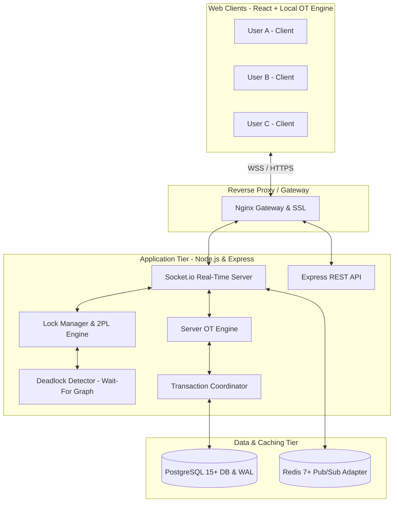

<div align="center">

# 📝 CollabWrite

### Real-Time Collaborative Document Editor with Operational Transformation

[](https://github.com/purvanshjoshi/CollabWrite/actions/workflows/ci.yml)
[](LICENSE)
[](https://nodejs.org/)
[](https://reactjs.org/)
[](https://www.postgresql.org/)
[](https://redis.io/)
[](CONTRIBUTING.md)

*An enterprise-grade, transparent, and resilient real-time co-authoring engine uniting advanced **Operating Systems** concurrency with **Database Management Systems** ACID transactions.*

[Architecture](#-system-architecture) • [OS & DBMS Mapping](#-os--dbms-concept-mapping) • [Quick Start](#-quick-start) • [OT Algorithm](#-operational-transformation-ot) • [Documentation](#-documentation-index)

---

</div>

## 📌 Overview

**CollabWrite** solves the fundamental challenge of multi-user concurrent text editing without relying on proprietary black-box algorithms. By pairing a transparent, mathematically proven **Operational Transformation (OT)** engine with **Two-Phase Locking (2PL)** and **Write-Ahead Logging (WAL)** on PostgreSQL, CollabWrite delivers sub-100ms edit propagation while guaranteeing zero data loss and deterministic convergence across all clients.

---

## ✨ Key Features

- ⚡ **Real-Time Operational Transformation:** Client-side optimistic rendering with automatic, transparent server-side linearization and transformation.
- 🔒 **Deadlock Detection & Concurrency Control:** Graph-based cycle detection on dynamic Wait-For Graphs (Tarjan's / DFS cycle detection) with automatic victim resolution.
- 💾 **ACID Persistence & Crash Recovery:** Industrial PostgreSQL schema with Write-Ahead Logging (`change_logs`), point-in-time version snapshotting, and automatic REDO replay on boot.
- 👥 **Multi-User Presence & Live Cursors:** Real-time remote cursor positioning, active text selection highlighting, and user status indicators.
- 🛡️ **Enterprise Security & RBAC:** Granular 3-tier Role-Based Access Control (`viewer`, `editor`, `owner`), JWT access/refresh token rotation, and strict input sanitization against XSS and SQL injection.
- 💬 **Threaded Inline Discussions:** Character offset-based commenting system with real-time replies and resolution tracking.
- 🐳 **Production Ready:** Fully containerized Docker Compose environment with health checks and horizontal scaling via Redis Pub/Sub.

---

## 🏛️ System Architecture



---

## 🧠 OS & DBMS Concept Mapping

CollabWrite serves as a real-world educational bridge between Operating Systems and Database Systems:

| Concept Domain | Academic Principle | CollabWrite Production Implementation |
| :--- | :--- | :--- |
| **OS** | **Mutual Exclusion (Mutex)** | In-memory document-level locks (`async-lock`) serializing critical OT transformation sections |
| **OS** | **Counting Semaphores** | Database client connection pooling managing concurrent transactions |
| **OS** | **Deadlock Detection** | Directed Wait-For Graph $G=(V,E)$ cycle analysis via DFS with victim preemption |
| **OS** | **Two-Phase Locking (2PL)** | Strict growing and shrinking phases during multi-paragraph reservation |
| **OS** | **Thread Pool & Async I/O** | Non-blocking event loop offloading intensive crypto & DB queries to Libuv workers |
| **DBMS** | **Atomicity & Consistency** | Transactional blocks (`BEGIN ... COMMIT`) wrapping document mutation, version increment, and WAL logging |
| **DBMS** | **Isolation Levels** | `SERIALIZABLE` and `READ COMMITTED` transactions preventing dirty and phantom reads |
| **DBMS** | **Write-Ahead Logging (WAL)** | Append-only `change_logs` table guaranteeing durability and full crash recovery |
| **DBMS** | **B+ Tree Indexing** | Composite indexing on `(document_id, server_version ASC)` for $O(\log N)$ historical range scans |
| **DBMS** | **Triggers & Stored Procedures** | PL/pgSQL triggers auto-maintaining word counts, character lengths, and comment counters |

---

## 🧮 Operational Transformation (OT)

Given two concurrent operations $O_1$ and $O_2$ executed against initial state $S$:

$$\text{apply}(\text{apply}(S, O_1), O_2') = \text{apply}(\text{apply}(S, O_2), O_1')$$

```
          S
        /   \
    O1 /     \ O2
      v       v
     S1       S2
      |       |
  O2' |       | O1'
      v       v
         S'   <--- Deterministic Convergence
```

- **Insert vs. Insert:** Position adjusted by content length with deterministic user ID tie-breaking.
- **Insert vs. Delete:** Insertion point offset or clamped relative to deletion ranges.
- **Delete vs. Delete:** Overlapping intervals clipped to prevent duplicate deletions.

---

## 🚀 Quick Start

### Prerequisites
- [Docker](https://www.docker.com/) and [Docker Compose](https://docs.docker.com/compose/) installed.
- (Optional for standalone manual setup): Node.js 20+ and PostgreSQL 15+.

### 1. Clone & Configure
```bash
git clone https://github.com/purvanshjoshi/CollabWrite.git
cd CollabWrite
cp .env.example .env
```

### 2. Launch with Docker Compose
```bash
docker-compose up -d --build
```

### 3. Access Services
- 🌐 **Frontend React Application:** [http://localhost:3000](http://localhost:3000)
- 🔌 **Backend REST API & WebSockets:** [http://localhost:3001](http://localhost:3001)
- 🗄️ **PostgreSQL Database:** `localhost:5432` (`collabwrite` / `collabuser`)
- ⚡ **Redis Pub/Sub:** `localhost:6379`

---

## 📁 Repository Structure

```
CollabWrite/
├── .github/                       # GitHub Actions workflows & templates
│   ├── workflows/
│   │   ├── ci.yml                 # Continuous integration pipeline
│   │   └── release.yml            # Semantic release automation
│   ├── ISSUE_TEMPLATE/            # Bug report and feature request templates
│   └── pull_request_template.md   # Standardized PR template
├── database/                      # Relational schema & migration scripts
│   ├── init.sql                   # Production PostgreSQL DDL (10 tables, triggers, views)
│   └── seeds/
│       └── 001_sample_data.sql    # Development seed dataset
├── docs/                          # Comprehensive technical documentation
│   ├── SPECIFICATION.md           # Master Project Specification (17 sections)
│   ├── architecture/              # System architecture & OS/DBMS deep-dives
│   ├── algorithms/                # OT mathematical proofs & Deadlock detection
│   ├── api/                       # REST API & WebSocket protocol specifications
│   ├── workflows/                 # User flows & sequence diagrams
│   ├── security/                  # RBAC matrix & threat modeling
│   ├── deployment/                # Docker, Kubernetes & Nginx configurations
│   ├── testing/                   # Property testing & concurrency stress suite
│   └── monitoring/                # Prometheus KPIs, health checks & runbooks
├── .editorconfig                  # Editor formatting rules
├── .env.example                   # Environment configuration template
├── .gitignore                     # Git exclusion rules
├── CHANGELOG.md                   # Version release notes
├── CODE_OF_CONDUCT.md             # Contributor Covenant Code of Conduct
├── CONTRIBUTING.md                 # Development & PR guidelines
├── docker-compose.yml             # Container orchestration configuration
├── LICENSE                        # MIT License
├── README.md                      # Project front-page overview
└── SECURITY.md                    # Vulnerability reporting policy
```

---

## 📚 Documentation Index

- 📑 **[Master Project Specification](docs/SPECIFICATION.md)**: Full 17-section definitive project spec.
- 🏗️ **[System Architecture](docs/architecture/system-architecture.md)**: Tier breakdown, state machines, and scaling.
- 🧠 **[OS & DBMS Concepts](docs/architecture/os-dbms-concepts.md)**: Theoretical mappings to production code.
- 🗄️ **[Database Schema & Indices](docs/architecture/database-schema.md)**: ER diagrams, performance indices, and triggers.
- 🧮 **[Operational Transformation Guide](docs/algorithms/operational-transformation.md)**: Transformation matrix and cursor algorithms.
- 🛑 **[Deadlock Detection](docs/algorithms/deadlock-detection.md)**: Two-Phase Locking and Wait-For Graph cycle detection.
- 🌐 **[REST API Reference](docs/api/rest-api.md)**: 20+ endpoints with request and response payloads.
- 🔌 **[WebSocket Protocol](docs/api/websocket-protocol.md)**: Event definitions, payloads, and heartbeat rules.
- 🔄 **[User Workflows](docs/workflows/user-workflows.md)**: End-to-end sequence flows for co-authoring and recovery.
- 🛡️ **[Security Architecture](docs/security/security-architecture.md)**: RBAC enforcement, XSS defense, and audit logging.
- 🚢 **[Deployment & Kubernetes](docs/deployment/docker-and-k8s.md)**: Containerization, K8s manifests, and Nginx SSL.
- 🧪 **[Testing Strategy](docs/testing/testing-strategy.md)**: Property-based fuzzing and stress testing.
- 📊 **[Monitoring & Maintenance](docs/monitoring/monitoring-and-maintenance.md)**: Prometheus metrics, SLOs, and backup runbooks.

---

## 🧪 Testing & Verification

```bash
# Run unit and integration tests
npm test

# Run OT Property (TP1 Invariant) Fuzzing
npm run test:ot

# Run Concurrency & Deadlock Stress Simulations
npm run test:deadlocks

# Lint and Code Style Check
npm run lint
```

---

## 🤝 Contributing

Contributions are warmly welcomed! Please read our [Contributing Guidelines](CONTRIBUTING.md) and [Code of Conduct](CODE_OF_CONDUCT.md) before submitting pull requests.

---

## 📄 License

This project is licensed under the [MIT License](LICENSE).
