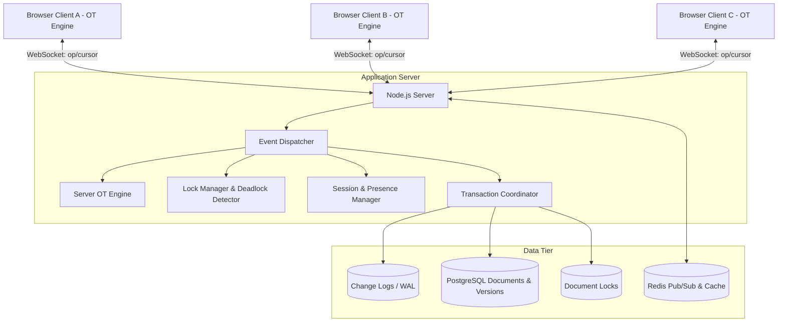
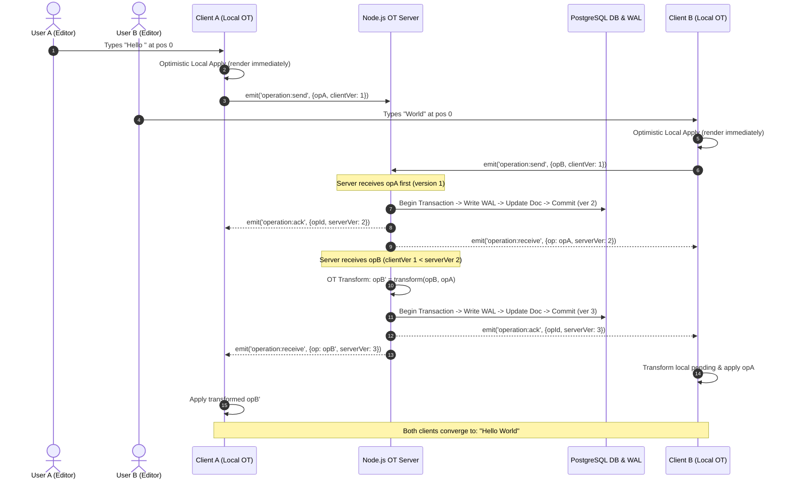

# CollabWrite - Complete Master Project Specification
## Real-Time Collaborative Document Editor with Operational Transformation

**Version:** 1.0.0  
**Status:** Production Ready  
**Last Updated:** January 2025  
**Author:** CollabWrite Core Architectural Team  

---

## TABLE OF CONTENTS

1. [Executive Summary](#1-executive-summary)
2. [Problem Statement](#2-problem-statement)
3. [Solution Overview](#3-solution-overview)
4. [Technical Architecture](#4-technical-architecture)
5. [Database Schema & Design](#5-database-schema--design)
6. [Operating Systems Concepts](#6-operating-systems-concepts)
7. [Database Management Systems Concepts](#7-database-management-systems-concepts)
8. [Core Algorithms](#8-core-algorithms)
9. [Feature Specifications](#9-feature-specifications)
10. [System Design Details](#10-system-design-details)
11. [API Specification (REST & WebSocket)](#11-api-specification)
12. [User Workflows & Sequence Diagrams](#12-user-workflows)
13. [Security Architecture & Threat Modeling](#13-security-architecture)
14. [Performance & Scalability](#14-performance--scalability)
15. [Testing & Verification Strategy](#15-testing-strategy)
16. [Deployment & Infrastructure Guide](#16-deployment-guide)
17. [Monitoring, Telemetry & Maintenance](#17-monitoring--maintenance)

---

## 1. EXECUTIVE SUMMARY

### 1.1 Project Overview
**CollabWrite** is an enterprise-grade, web-based collaborative document editing platform designed to enable multiple users to edit shared documents simultaneously without conflicts, data loss, or race conditions. The platform seamlessly bridges fundamental **Operating System concepts** (concurrency, synchronization, mutexes, semaphores, deadlock detection via wait-for graphs) with **Database Management System concepts** (ACID transactions, multi-version concurrency control, serializable isolation, indexing, write-ahead logging) into an industrial-strength application.

### 1.2 Problem Statement
Traditional document editing either forces sequential access (preventing concurrent editing) or allows uncoordinated simultaneous edits leading to data corruption, lost updates, and race conditions. Proprietary suites (e.g., Google Docs, Microsoft Office 365) hide their synchronization mechanics. CollabWrite delivers:
- **Transparent Operational Transformation (OT)** visible in clean, auditable code.
- **Deep educational rigor** demonstrating OS + DBMS integration in real-world software.
- **Production-grade reliability** backed by ACID database transactions, pessimistic section locking, and write-ahead crash recovery.
- **Low-latency real-time synchronization** (<100ms propagation across 50+ concurrent users per document).

### 1.3 Core Innovation Matrix
CollabWrite combines **Client-Server Operational Transformation**, **Two-Phase Locking (2PL)**, and **Write-Ahead Logging (WAL)** to achieve:
- Zero data loss during concurrent, non-overlapping, and overlapping edits.
- Automatic mathematical conflict resolution without manual merge prompts.
- Proactive cycle detection on resource dependency graphs to prevent deadlocks.
- Instantaneous crash recovery by replaying unpersisted WAL change logs on server boot.

---

## 2. PROBLEM STATEMENT

### 2.1 The Concurrency Challenges in Collaborative Systems

#### Scenario 1: Sequential Access Bottleneck
```
User A: "Acquires exclusive document lock"
User B: "Blocked. Cannot edit until User A disconnects."
```
*Impact:* Unusable for modern teams requiring simultaneous co-authoring.

#### Scenario 2: Uncoordinated Concurrent Edits (Lost Updates)
```
Document initial state: "Hello"
User A at pos 0 inserts "Hi "  -> "Hi Hello"
User B at pos 0 inserts "Hey " -> "Hey Hello"
Server naive write order: User B overwrites User A's changes.
```
*Impact:* Silent data corruption; one author's work is deleted without notice.

#### Scenario 3: Race Conditions on Version Numbers
```
Thread 1 (User A): Read version=1, compute new state, write version=2
Thread 2 (User B): Read version=1 (before Thread 1 commits), write version=2
```
*Impact:* Database anomaly; version increments are lost and history becomes non-linear.

#### Scenario 4: Deadlocks in Multi-Resource Contention
```
User A: Holds Write Lock on Paragraph 1, Requests Write Lock on Paragraph 2 (Blocked)
User B: Holds Write Lock on Paragraph 2, Requests Write Lock on Paragraph 1 (Blocked)
```
*Impact:* Permanent circular stall; both users are frozen until timeout or crash.

#### Scenario 5: Mid-Edit Server Crash
```
Server accepts edit, confirms to client, but power fails before disk fsync.
```
*Impact:* Client believes edit is safe, but database state reverts.

---

## 3. SOLUTION OVERVIEW

### 3.1 High-Level Architectural Flow



### 3.2 Key Architectural Principles
1. **Safety & Durability First:** Every operation is logged to the database WAL before memory state is confirmed.
2. **Deterministic Convergence:** Given the same set of operations, all connected clients converge to the exact same document state regardless of network delay.
3. **Pessimistic & Optimistic Synergy:** Content editing uses optimistic OT, while structural operations (permissions, section reservation, deletions) utilize pessimistic locking.
4. **Modular Separation:** OS synchronization primitives, DBMS transactional logic, and OT algorithms exist as isolated, unit-testable modules.

---

## 4. TECHNICAL ARCHITECTURE

### 4.1 3-Tier Architecture Breakdown

```
+-------------------------------------------------------------+
|                      PRESENTATION TIER                      |
|  - React 18 SPA (Hooks, Context, Draft.js / Slate.js)       |
|  - Local OT Client Engine (Optimistic Apply & Rollback)     |
|  - Socket.io Client (Auto-reconnect, Heartbeat, Presence)   |
+-------------------------------------------------------------+
                              |
                              | HTTPS / WSS
                              v
+-------------------------------------------------------------+
|                      APPLICATION TIER                       |
|  - Express.js HTTP API (REST Endpoints, JWT Authentication) |
|  - Socket.io Real-Time Server (Namespaced document rooms)   |
|  - Server OT Engine (Linearization, Transformation Matrix)  |
|  - Lock Manager (2PL, Tarjan DFS Wait-For Graph Detector)   |
|  - Transaction Coordinator (Knex / pg Client with ACID)     |
+-------------------------------------------------------------+
                              |
                              | TCP / Connection Pool
                              v
+-------------------------------------------------------------+
|                         DATA TIER                           |
|  - PostgreSQL 15+ (Relational tables, WAL, Indices, Views)  |
|  - Redis 7+ (Horizontal multi-node pub/sub broadcast)       |
+-------------------------------------------------------------+
```

---

## 5. DATABASE SCHEMA & DESIGN

### 5.1 Relational Schema Details

The database schema comprises 10 core tables designed for high throughput, data integrity, and complete crash recoverability:

1. **`users`**: User identity, credentials (`bcrypt`), avatars, and admin roles.
2. **`documents`**: Document metadata, current text content, version counters, metrics (word/character counts), and soft delete timestamps.
3. **`document_permissions`**: Granular RBAC permissions (`viewer`, `editor`, `owner`) with temporal expiration.
4. **`change_logs`**: Append-only Write-Ahead Log storing atomic operations (`insert`, `delete`, `replace`, `format`), character offsets, client/server version markers, and transform metadata.
5. **`document_versions`**: Periodic full-text snapshots taken every $N$ operations to optimize historical restoration.
6. **`user_sessions`**: Ephemeral active presence records tracking socket IDs, cursor positions, IP addresses, and heartbeats.
7. **`document_locks`**: Pessimistic read/write locks at document or paragraph granularities with expiration deadlines.
8. **`comments`**: Threaded inline document feedback linked to character offset ranges.
9. **`document_tags`**: Taxonomic metadata for categorization and search.
10. **`audit_logs`**: Tamper-evident record of administrative and security events.

*(Refer to `database/init.sql` for the complete SQL statements, constraints, and trigger definitions).*

---

## 6. OPERATING SYSTEMS CONCEPTS

### 6.1 Concurrency & Synchronization Primitives
- **Mutual Exclusion (Mutex):** Critical sections in the OT Engine (processing incoming operations per document) are guarded by in-memory mutexes (`async-lock`) to serialize state transitions.
- **Counting Semaphores:** Database connection pool limits (max 20 concurrent transactions per Node instance) prevent thread starvation and memory exhaustion.
- **Race Condition Prevention:** Atomic database operations (`UPDATE documents SET version = version + 1 WHERE id = $1 RETURNING version`) eliminate double-write anomalies.

### 6.2 Deadlock Detection (Wait-For Graph)
- **Two-Phase Locking (2PL):** Growing phase (all required section locks acquired) and Shrinking phase (all locks released upon commit).
- **Cycle Detection:** Dynamic directed Wait-For Graph $G = (V, E)$ where vertices $V$ represent active users and edges $E = \{(u_1, u_2)\}$ represent user $u_1$ waiting on a resource locked by $u_2$.
- **Tarjan's / DFS Cycle Detection:** Evaluated on every lock acquisition request. If a cycle is detected, the transaction with the lowest priority or latest timestamp is aborted.

### 6.3 Thread Pool & Async I/O
- Node.js event loop handles thousands of concurrent WebSocket connections non-blockingly.
- Intensive crypto and disk I/O tasks are offloaded to Libuv thread workers (`UV_THREADPOOL_SIZE=128`).

---

## 7. DATABASE MANAGEMENT SYSTEMS CONCEPTS

### 7.1 ACID Guarantees
- **Atomicity:** Updates to `documents`, increments to `version`, and insertions into `change_logs` occur within a single database transaction block (`BEGIN ... COMMIT`).
- **Consistency:** Foreign key constraints, check constraints (e.g., valid email formats, positive versions), and triggers maintain relational integrity.
- **Isolation:** Serializable and Read-Committed isolation levels prevent dirty reads, non-repeatable reads, and phantom reads.
- **Durability:** PostgreSQL WAL and synchronous commit ensure committed edits persist across hardware crashes.

### 7.2 Indexing & Query Plan Optimization
- **Composite B+ Tree Indexing:** `(document_id, server_version ASC)` on `change_logs` allows logarithmic $O(\log N)$ range scans when pulling missed operations during client catch-up.
- **Denormalization via Triggers:** Document word/character counts and comment counts are maintained via triggers, avoiding expensive aggregate queries.

---

## 8. CORE ALGORITHMS

### 8.1 Operational Transformation (OT) Formulation

Let an operation $O$ be defined as $O = \langle \text{type}, \text{pos}, \text{content}, \text{len} \rangle$.

Given two concurrent operations $O_1$ and $O_2$ executed against base document state $S_0$:
$$S_1 = \text{apply}(S_0, O_1), \quad S_2 = \text{apply}(S_0, O_2)$$

The transformation function $T(O_1, O_2) = (O_1', O_2')$ satisfies the Transformation Property 1 (**TP1**):
$$\text{apply}(\text{apply}(S_0, O_1), O_2') = \text{apply}(\text{apply}(S_0, O_2), O_1')$$

#### Transform Cases:
1. **Insert vs. Insert:**
   - If $\text{pos}_1 < \text{pos}_2$: $O_2' = \langle \text{insert}, \text{pos}_2 + \text{len}_1, \text{content}_2 \rangle$, $O_1' = O_1$.
   - If $\text{pos}_1 = \text{pos}_2$: Tie-breaker based on user ID:
     - If $\text{userId}_1 < \text{userId}_2$: $O_1$ placed first; $O_2'.\text{pos} = \text{pos}_2 + \text{len}_1$.
     - Else: $O_2$ placed first; $O_1'.\text{pos} = \text{pos}_1 + \text{len}_2$.
2. **Insert vs. Delete:**
   - If $\text{pos}_{\text{ins}} \le \text{pos}_{\text{del}}$: Delete position shifted right by insert length.
   - If $\text{pos}_{\text{ins}} > \text{pos}_{\text{del}} + \text{len}_{\text{del}}$: Insert position shifted left by delete length.
   - If $\text{pos}_{\text{ins}}$ falls inside delete range: Insert pos clamped to $\text{pos}_{\text{del}}$.
3. **Delete vs. Delete:**
   - Non-overlapping: Shift subsequent delete position.
   - Overlapping: Overlap computed and deleted lengths truncated to avoid duplicate deletions.

---

## 9. FEATURE SPECIFICATIONS

### 9.1 Real-Time Rich Text Editing
- Simultaneous typing by 50+ users on the same document.
- Low-latency WebSocket operation streaming.
- Bold, italic, underline, lists, headers, and code block formatting.

### 9.2 Live Presence & Remote Cursors
- Colored cursor and selection highlights for all active co-authors.
- User presence avatars with active/idle/disconnected indicators.
- Automatic session cleanup after 30 seconds of inactivity.

### 9.3 Version History & Snapshots
- Immutable audit log of every keystroke.
- Point-in-time document diffing and one-click rollback.
- Named version tags and manual snapshot creation.

### 9.4 Section-Level Pessimistic Locking
- Ability for a user to lock a specific paragraph or section for exclusive drafting.
- Clear visual indicator of locked sections to other collaborators.
- Automatic release on user disconnect or inactivity timeout.

### 9.5 Inline Commenting & Discussions
- Highlight text to create threaded comment conversations.
- Real-time comment addition, reply notifications, and resolution markers.

---

## 10. SYSTEM DESIGN DETAILS

### 10.1 Component Interaction Diagram



---

## 11. API SPECIFICATION

*(See [REST API Specification](api/rest-api.md) and [WebSocket Protocol Specification](api/websocket-protocol.md) for full endpoint schemas and payload structures).*

---

## 12. USER WORKFLOWS

*(See [User Workflows](workflows/user-workflows.md) for detailed step-by-step flows and edge cases).*

---

## 13. SECURITY ARCHITECTURE

*(See [Security Architecture](security/security-architecture.md) for RBAC enforcement, XSS sanitization, JWT lifecycle, and audit policies).*

---

## 14. PERFORMANCE & SCALABILITY

*(See [Performance & Scalability](architecture/system-architecture.md#scalability-and-performance) for benchmarks, connection pooling, and Redis pub/sub multi-node clustering).*

---

## 15. TESTING STRATEGY

*(See [Testing Strategy](testing/testing-strategy.md) for OT property-based testing, fuzzing, and concurrency stress testing).*

---

## 16. DEPLOYMENT GUIDE

*(See [Deployment Guide](deployment/docker-and-k8s.md) for Docker Compose, Kubernetes manifests, and Nginx configurations).*

---

## 17. MONITORING & MAINTENANCE

*(See [Monitoring & Maintenance](monitoring/monitoring-and-maintenance.md) for Prometheus telemetry, Grafana metrics, and backup/restore runbooks).*
