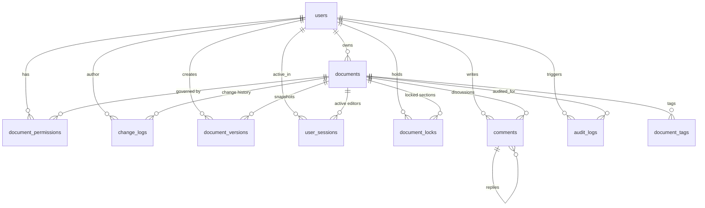

# Database Schema & Performance Guide

## 1. Relational Entity-Relationship Diagram



---

## 2. Table Specifications

### 2.1 `users`
Primary identity and authentication table.
- **`id`** (`SERIAL PRIMARY KEY`): Unique user identifier.
- **`email`** (`VARCHAR(255) UNIQUE NOT NULL`): Validated via regex check constraint.
- **`username`** (`VARCHAR(100) UNIQUE NOT NULL`): Public display handle.
- **`password_hash`** (`VARCHAR(255) NOT NULL`): Bcrypt salted hash (work factor 12).
- **`is_admin`** (`BOOLEAN DEFAULT FALSE`): Global administrative privilege.

### 2.2 `documents`
Core document storage and content state.
- **`id`** (`SERIAL PRIMARY KEY`): Unique document identifier.
- **`owner_id`** (`INT REFERENCES users(id) ON DELETE CASCADE`): Author and owner.
- **`title`** (`VARCHAR(500) NOT NULL`): Document title.
- **`content`** (`TEXT NOT NULL DEFAULT ''`): Complete document text content.
- **`version`** (`INT NOT NULL DEFAULT 1`): Monotonically increasing version counter.
- **`is_deleted`** (`BOOLEAN DEFAULT FALSE`): Soft delete flag.
- **`word_count` / `character_count`** (`INT DEFAULT 0`): Automatically computed via triggers.

### 2.3 `change_logs` (Write-Ahead Log)
Immutable log of every atomic edit operation.
- **`id`** (`BIGSERIAL PRIMARY KEY`): Global ordering sequence.
- **`document_id`** (`INT REFERENCES documents(id) ON DELETE CASCADE`): Target document.
- **`operation_id`** (`VARCHAR(255) UNIQUE`): Client-generated idempotency key.
- **`operation_type`** (`ENUM('insert', 'delete', 'replace', 'format')`): Operation classification.
- **`position`** (`INT NOT NULL`): Zero-indexed character offset.
- **`content`** (`TEXT`): Inserted string (for insert operations).
- **`deleted_content`** (`TEXT`): Deleted string (for delete/replace operations).
- **`client_version`** (`INT NOT NULL`): Base version client operated upon.
- **`server_version`** (`INT NOT NULL`): Resulting server version after linearization.

### 2.4 `document_locks`
Pessimistic concurrency table enforcing 2-Phase Locking (2PL).
- **`id`** (`SERIAL PRIMARY KEY`)
- **`document_id`** (`INT REFERENCES documents(id) ON DELETE CASCADE`)
- **`user_id`** (`INT REFERENCES users(id) ON DELETE CASCADE`)
- **`lock_type`** (`ENUM('read', 'write') DEFAULT 'write'`)
- **`section_id`** (`INT`): Optional paragraph / section ID.
- **`expires_at`** (`TIMESTAMP WITH TIME ZONE NOT NULL`): Auto-release deadline.
- **`lock_token`** (`VARCHAR(255) UNIQUE NOT NULL`): Cryptographic bearer token.

---

## 3. High-Performance Indices

```sql
-- 1. Accelerates client catch-up queries in O(log N)
CREATE INDEX idx_change_logs_doc_version ON change_logs(document_id, server_version ASC);

-- 2. Real-time active collaborator presence lookup (<1ms execution)
CREATE INDEX idx_sessions_doc_active ON user_sessions(document_id, is_active);

-- 3. Fast user permission evaluation on WebSocket connect
CREATE INDEX idx_doc_permissions_lookup ON document_permissions(document_id, user_id);

-- 4. Expiration scanner for Deadlock and Lock Manager cleanup
CREATE INDEX idx_locks_expires_at ON document_locks(expires_at);
```
