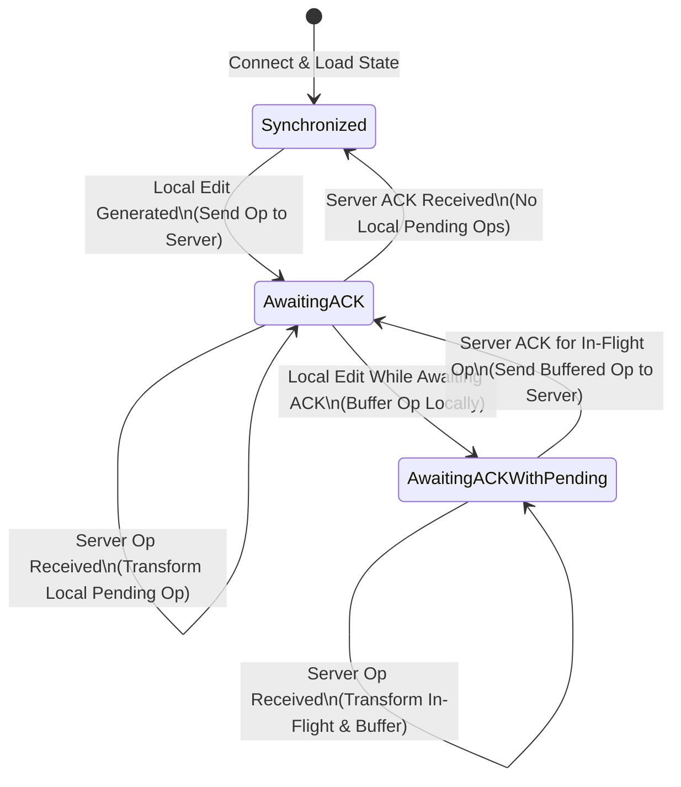

# CollabWrite - System Architecture & Design

## 1. Architectural Overview

CollabWrite is designed around a multi-tier, event-driven reactive architecture. It provides continuous synchronization across distributed web clients while guaranteeing strict consistency, durability, and fault tolerance at the data layer.

```mermaid
graph TB
    subgraph Client Tier [Client Tier - Browser]
        UI[React UI Components]
        LocalOT[Local OT Engine]
        WSClient[Socket.io WebSocket Client]
        HTTPClient[Axios HTTP Client]
        
        UI <--> LocalOT
        LocalOT <--> WSClient
        UI <--> HTTPClient
    end

    subgraph Gateway [Load Balancer & Reverse Proxy]
        Nginx[Nginx Reverse Proxy / SSL Termination]
    end

    subgraph App Tier [Application Server Tier - Node.js]
        Express[Express.js REST API]
        WSServer[Socket.io Server]
        Auth[JWT & RBAC Middleware]
        OTServer[Server OT Engine]
        LockMgr[Lock Manager & 2PL Engine]
        DeadlockDetector[Deadlock Detector - Tarjan DFS]
        TxCoord[Transaction Coordinator]
        
        Express --- Auth
        WSServer --- Auth
        WSServer <--> OTServer
        WSServer <--> LockMgr
        LockMgr <--> DeadlockDetector
        OTServer <--> TxCoord
        LockMgr <--> TxCoord
    end

    subgraph Data Tier [Data & Caching Tier]
        Postgres[(PostgreSQL 15+ Primary)]
        Redis[(Redis 7+ Pub/Sub & Lock Cache)]
        
        TxCoord <--> Postgres
        WSServer <--> Redis
        LockMgr <--> Redis
    end

    WSClient <-->|WSS (WebSocket)| Nginx
    HTTPClient <-->|HTTPS (REST)| Nginx
    Nginx <--> WSServer
    Nginx <--> Express
```

---

## 2. Component Responsibilities

### 2.1 Client Tier
- **Rich Text Editor (React + Draft.js / ContentEditable):** Captures user keystrokes, selection changes, and formatting events.
- **Local OT Engine:** Maintains a 3-state buffer (`Synchronized`, `AwaitingACK`, `AwaitingACKWithPending`) to render local edits with zero input lag while buffering outgoing transformations.
- **Presence Controller:** Broadcasts cursor positions, text selection ranges, and heartbeats every 30 seconds.

### 2.2 Application Tier (Node.js)
- **Event Dispatcher (`socket/documentHandlers.js`):** Routes incoming Socket.io messages to corresponding controllers.
- **Server OT Engine (`services/OTEngine.js`):** Serializes incoming operations into an immutable linear timeline, applies transformation against intervening operations, and broadcasts transformed deltas.
- **Lock Manager (`services/LockManager.js`):** Coordinates section-level pessimistic locks using 2-Phase Locking (2PL).
- **Deadlock Detector (`services/DeadlockDetector.js`):** Builds and maintains an in-memory Wait-For Graph, detecting circular dependencies using Depth-First Search (DFS).
- **Transaction Coordinator (`services/TransactionCoordinator.js`):** Manages ACID database transactions, ensuring Write-Ahead Log entries are written to PostgreSQL before operation ACKs are returned.

### 2.3 Data Tier (PostgreSQL & Redis)
- **PostgreSQL 15+:** Primary ACID data store. Houses documents, full historical change logs, user profiles, permissions, and periodic snapshots.
- **Redis 7+:** Socket.io Redis adapter for cross-node horizontal scaling, ephemeral lock expiration caching, and pub/sub message distribution.

---

## 3. Client-Side OT State Machine

The client OT engine operates as a deterministic finite state machine (FSM) to ensure instantaneous typing feedback without waiting for server network round-trips:



### State Definitions:
1. **`Synchronized`**: Client state is identical to server state. No unacknowledged operations.
2. **`AwaitingACK`**: One operation has been sent to the server and is awaiting confirmation. Client displays this change optimistically.
3. **`AwaitingACKWithPending`**: One operation is in-flight to the server, and the user has continued typing. New edits are held in a pending buffer and composed/transformed locally.

---

## 4. Scalability & Performance

### 4.1 Horizontal Scaling with Redis Pub/Sub
When scaling across multiple Node.js application instances behind a load balancer, Socket.io clients may be connected to different servers:

```
[Client 1] ---> [App Instance A] \
                                   ---> [Redis Pub/Sub Channel "doc:123"]
[Client 2] ---> [App Instance B] /
```

1. App Instance A processes an operation for Document 123.
2. Instance A applies the OT transformation and writes to PostgreSQL.
3. Instance A publishes the transformed operation to Redis channel `doc:123`.
4. Instance B receives the message from Redis and broadcasts it to Client 2 over WebSocket.

### 4.2 Database Connection Pooling
- PostgreSQL connection pool sized dynamically based on core count and workload:
  $$\text{Pool Size} = (\text{Core Count} \times 2) + \text{Effective Spindle Count}$$
- Default configuration: `min: 2`, `max: 20` per Node process.
- Database transactions use explicit timeouts (`statement_timeout = '5000ms'`) to prevent connection starvation.
