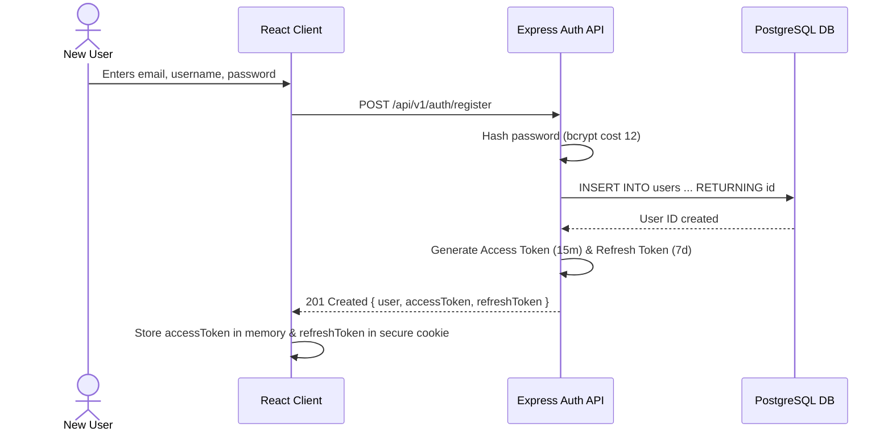
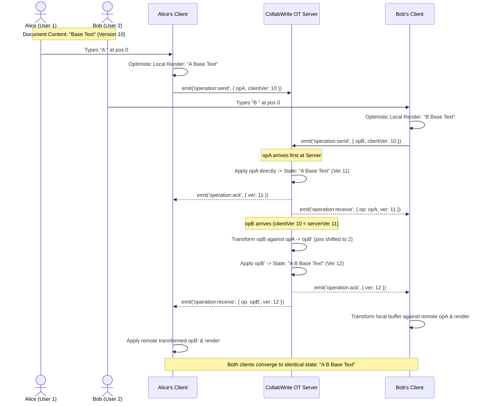
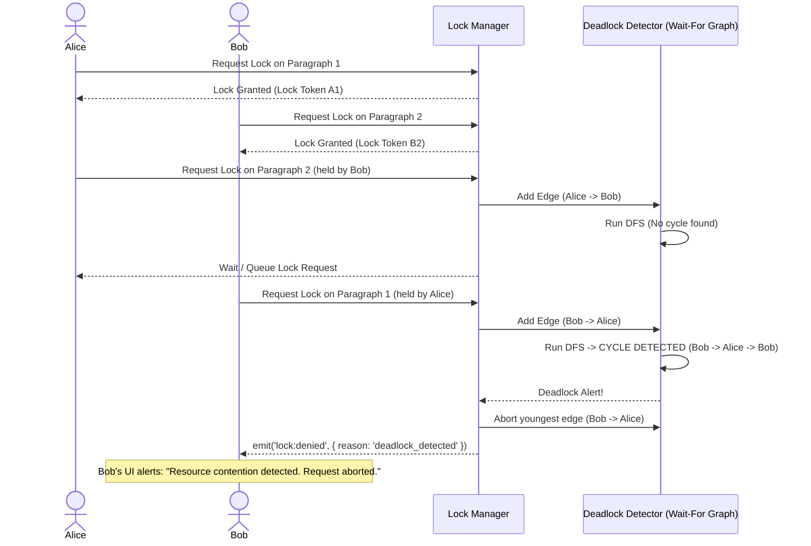
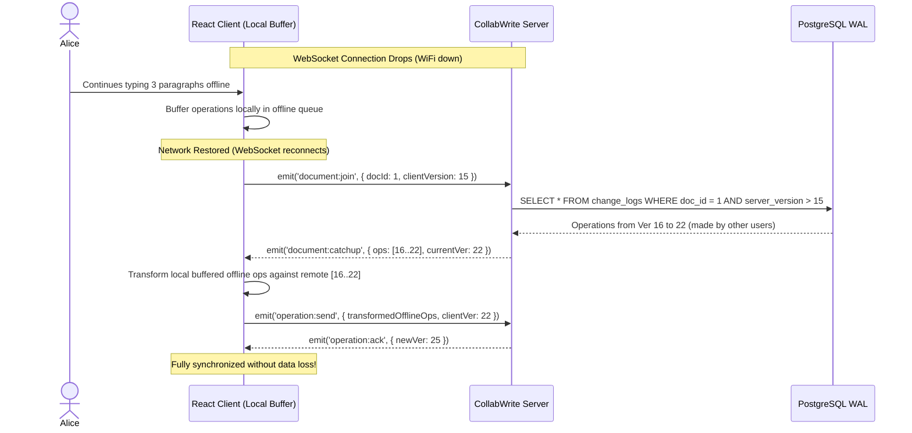

# Complete User Workflows & Scenarios

---

## Workflow 1: User Registration & Session Initialization

---

## Workflow 2: Simultaneous Concurrent Edits (OT Convergence)

---

## Workflow 3: Section Lock Contention & Deadlock Prevention

---

## Workflow 4: Network Disconnection & Re-synchronization

---

## Workflow 5: Version History Snapshot & Rollback
1. User clicks **"History"** in editor toolbar.
2. Client requests `GET /api/v1/documents/:id/versions`.
3. UI presents a timeline diff viewer with visual character additions and deletions.
4. User selects Version 5 and clicks **"Revert to this Version"**.
5. Server generates an atomic compensation operation (`replace`) reverting current content to Version 5 snapshot content.
6. Server increments version counter to $(N+1)$, commits to WAL, and broadcasts the revert delta to all connected clients.
